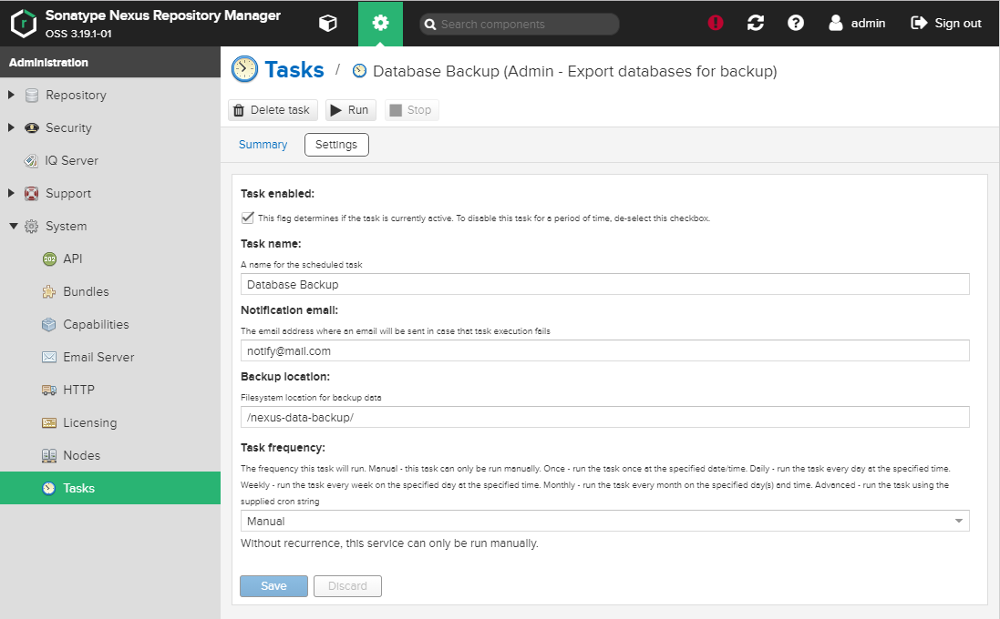

<!--

    Sonatype Nexus (TM) Open Source Version
    Copyright (c) 2018-present Sonatype, Inc.
    All rights reserved. Includes the third-party code listed at http://links.sonatype.com/products/nexus/oss/attributions.

    This program and the accompanying materials are made available under the terms of the Eclipse Public License Version 1.0,
    which accompanies this distribution and is available at http://www.eclipse.org/legal/epl-v10.html.

    Sonatype Nexus (TM) Professional Version is available from Sonatype, Inc. "Sonatype" and "Sonatype Nexus" are trademarks
    of Sonatype, Inc. Apache Maven is a trademark of the Apache Software Foundation. M2eclipse is a trademark of the
    Eclipse Foundation. All other trademarks are the property of their respective owners.

-->
# Nexus Shutdown Backup Plugin

# Table Of Contents
* [Developing](#developing)
   * [Requirements](#requirements)
   * [Building](#building)
   * [Testing](#testing)
* [Using Plugin with Nexus Repository Manger 3](#using-plugin-with-nexus-repository-manager-3)
* [Installing the plugin](#installing-the-plugin)
   * [Temporary Install](#temporary-install)
   * [(more) Permanent Install](#more-permanent-install)
   * [(most) Permament Install](#most-permanent-install)
* [The Fine Print](#the-fine-print)
* [Getting Help](#getting-help)

## Developing

### Requirements

* [Apache Maven 3.3.3+](https://maven.apache.org/install.html)
* [Java 8+](http://www.oracle.com/technetwork/java/javase/downloads/jdk8-downloads-2133151.html)
* Network access to https://repository.sonatype.org/content/groups/sonatype-public-grid

Also, there is a good amount of information available at [Bundle Development](https://help.sonatype.com/display/NXRM3/Bundle+Development)

### Building

You can build the project with the integrated maven wrapper like so:

```shell
./mvnw clean package
```

If everything checks out, the bundle should be available in the `target` folder

You can also build locally using Docker by running:

```shell
docker run --rm -it -v $(pwd):/data -w /data maven:3.5.2 mvn clean package
```

### Testing

You can build a ready to run docker image using the [`Dockerfile`](Dockerfile) to quickly spin up a nexus with the plugin already preinstalled:

```shell
docker build -t rti-sonatype-nexus:3.19.1-shutdown-backup-plugin .

mkdir $(pwd)/nexus-data-backup
docker run --rm -it -v $(pwd)/nexus-data-backup:/nexus-data-backup -p 8081:8081 rti-sonatype-nexus:3.19.1-shutdown-backup-plugin
```

To get the admin password use:

```shell
docker exec -it <container-id> cat /nexus-data/admin.password
```

You must also have a "Exports databases for backup" task configured with the proper folder:



## Using Plugin With Nexus Repository Manager 3

Requires Nexus Repository Manager version >= 3.8.0

## Installing the plugin

There are a range of options for installing the plugin. You'll need to build it first, and
then install the plugin with the options shown below:

### Temporary Install

Installations done via the Karaf console will be wiped out with every restart of Nexus Repository. This is a
good installation path if you are just testing or doing development on the plugin.

* Enable Nexus console: edit `<nexus_dir>/bin/nexus.vmoptions` and change `karaf.startLocalConsole`  to `true`.

  More details here: [Bundle Development](https://help.sonatype.com/display/NXRM3/Bundle+Development+Overview)

* Run Nexus' console:
  ```
  # sudo su - nexus
  $ cd <nexus_dir>/bin
  $ ./nexus run
  > bundle:install file:///tmp/nexus3-shutdown-backup-plugin-1.0.2.jar
  > bundle:list
  ```
  (look for org.sonatype.nexus.plugins:nexus3-shutdown-backup-plugin ID, should be the last one)
  ```
  > bundle:start <org.sonatype.nexus.plugins:nexus3-shutdown-backup-plugin ID>
  ```

### (more) Permanent Install

For more permanent installs of the plugin, follow these instructions:

* Copy the bundle (nexus3-shutdown-backup-plugin-1.0.0.jar) into <nexus_dir>/deploy

This will cause the plugin to be loaded with each restart of Nexus Repository. As well, this folder is monitored
by Nexus Repository and the plugin should load within 60 seconds of being copied there if Nexus Repository
is running. You will still need to start the bundle using the karaf commands mentioned in the temporary install.

### (most) Permanent Install
# FIXME

## The Fine Print

It is worth noting that this is **NOT SUPPORTED** by Sonatype, and is a contribution of ours
to the open source community (read: you!)

Remember:

* Use this contribution at the risk tolerance that you have
* Do NOT file Sonatype support tickets related to CPAN support in regard to this plugin
* DO file issues here on GitHub, so that the community can pitch in

Phew, that was easier than I thought. Last but not least of all:

Have fun creating and using this plugin and the Nexus platform, we are glad to have you here!

## Getting help

Looking to contribute to our code but need some help? There's a few ways to get information:

* Chat with us on [Gitter](https://gitter.im/sonatype/nexus-developers)
* Check out the [Nexus3](http://stackoverflow.com/questions/tagged/nexus3) tag on Stack Overflow
* Check out the [Nexus Repository User List](https://groups.google.com/a/glists.sonatype.com/forum/?hl=en#!forum/nexus-users)


## Development

You can build the project with the integrated maven wrapper like so:

```shell
./mvnw clean package
```

or can also build locally using Docker by running:

```shell
docker run --rm -it -v $(pwd):/data -w /data maven:3.5.2 mvn clean package
```

## Testing

You can build a ready to run docker image using the [`Dockerfile`](Dockerfile) to quickly spin up a nexus with the plugin already preinstalled:

```shell
docker build -it rti-sonatype-nexus:3.19.1-bitbucketcloud-auth-plugin .

docker run -p 8081:8081 rti-sonatype-nexus:3.19.1-bitbucketcloud-auth-plugin
```

to get the admin password

```shell
docker exec -it <container-id> cat /nexus-data/admin.password
```